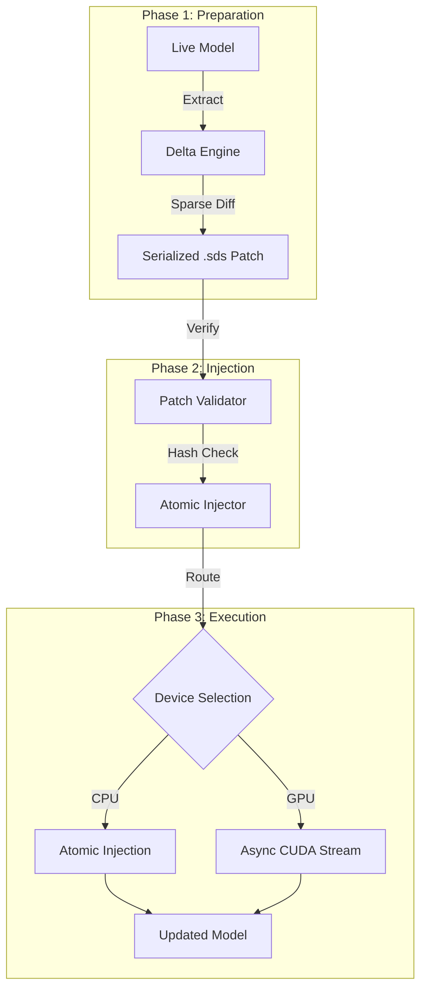

[](https://pypi.org/project/synaptic-delta-sync/)
[](https://opensource.org/licenses/MIT)

# Synaptic-Delta-Sync (SDS) 🚀

**Synaptic-Delta-Sync (SDS)** is a high-performance, production-grade infrastructure library designed for **atomic, secure, and zero-downtime** neural network weight updates.

In modern AI environments, updating models often requires a full restart, leading to service disruption. SDS bridges this gap by enabling **hot-swapping of weights** directly into live inference engines without stopping the process.

---

## 🏗️ Architecture Overview

The SDS pipeline is designed for modularity, speed, and integrity. The architecture separates weight extraction, cryptographic validation, and device-specific injection into distinct, highly optimized layers.



---

## 💎 Core Technical Pillars

* **Atomic Injection & Zero-Downtime**: SDS modifies model weights at the memory-pointer level using `torch.no_grad()`, ensuring zero-drop inference.
* **Sparse Delta Engine**: Reduces patch sizes from MBs to KBs using mathematical delta computation.
* **Cryptographic Security**: SHA-256 integrity handshake verifies every patch before application.
* **Dual-Engine Performance**: Optimized paths for both CPU (direct memory) and GPU (Async CUDA Streams).

---

## 📦 Quick Start

### Installation

Clone the repository to your local workspace:

```bash
git clone [https://github.com/ANSH-GIT77/synaptic-delta-sync.git](https://github.com/ANSH-GIT77/synaptic-delta-sync.git)
cd synaptic-delta-sync

```

### Basic Usage

The `AtomicInjector` class handles all the heavy lifting automatically:

```python
from sds.core.injection import AtomicInjector
from sds.protocol.serializer import load_patch

# 1. Initialize engine
injector = AtomicInjector(model)

# 2. Load secure patch
delta, metadata, patch_hash = load_patch("updates.sds")

# 3. Apply patch
injector.apply_patch(delta, patch_hash=patch_hash)

```

---

## 📁 Project Structure

```text
synaptic-delta-sync/
├── sds/
│   ├── core/           # Engine Logic
│   ├── hot_swap/       # Validation
│   └── protocol/       # Serialization
├── examples/           # Tests
└── pyproject.toml      # Config

```

---

## 📈 Roadmap

* **v0.1.0**: Core Engine & Security Validator.
* **Next**: Distributed Patching (RPC) & Multi-GPU sharding.

---

## 🤝 Author

**Ansh Nimbalkar** | *AI Infrastructure Engineer*

[GitHub Profile](https://github.com/ANSH-GIT77)
